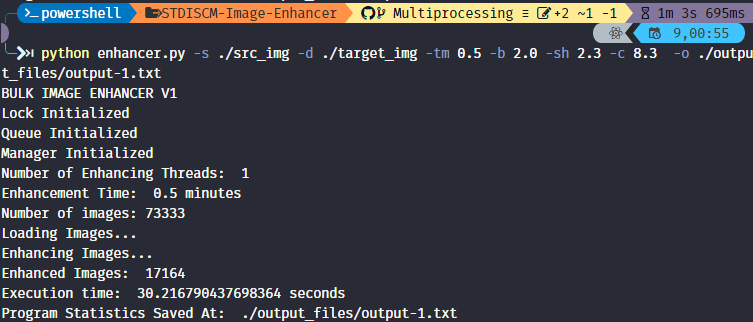

# STDISCM-Image-Enhancer

Major Course Output for STDISCM

<br/><p align="center"></p><br/>

In this project, a parallel-processing-based bulk image enhancer program is created, which utilizes parallel-processing techniques to handle multiple batches of images. The program is created using the Python programming language along with its Multiprocessing library and the Pillow library, which is an open-source library for image manipulation.

## Contents:

- [experiment_results](experiment_results) - Results and analysis of the experiments performed in the program
- [output_files](output_files) - Sample test outputs and screenshots
- [src_img](src_img) - Source images (contains 73,333 imgs) -[.gitignore](.gitignore) - Gitignore file
- [enhancer.py](enhancer.py) - Image enhancer program
- [README.md](README.md) - Readme file
- [STDISCM - Image Enhancer Project]() - Project Specifications
- [testCommands.txt](testCommands.txt) - Sample commands for running the program

## How to Run the Program

Using a CLI:

1. Clone the repository

```
git clone https://github.com/superkrunchii/STDISCM-Image-Enhancer.git
```

2. Run the program given the required arguments

```
python enhancer.py -s ./src_img -d ./target_img -tm 0.5 -b 2.0 -sh 2.3 -c 8.3
```

3. Enjoy the program!!

## Program Usage

```
Required Arguments
-s/--src          Source Image Folder
-d/--dest         Destination Folder
-tm/--time        Image Enhancing Time in Minutes
-b/--brightness   Image Brightness Ratio
-c/--contrast     Image Contrast Ratio
-sh/--sharpness   Image Sharpness Ration

Optional Arguments
-t/--threads      Number of Enhancement Threads (default: 1)
-o/--output       Output Filename (default: stats.txt)
```

## Sample Program Usage

```
python enhancer.py -s ./src_img -d ./target_img -tm 1 -b 2.0 -sh 2.3 -c 8.3  -o ./output_files/output-5.txt -t 10
```

This runs the program with 10 enhancement threads, enhancement time of 1 minute, 2.0 brightness ratio, 2.3 sharpness ration, and 8.3 contrast ratio.

## Authors

- **CHUA**, Josh Nielsen
- **MONEDA**, Heinze Kristian
